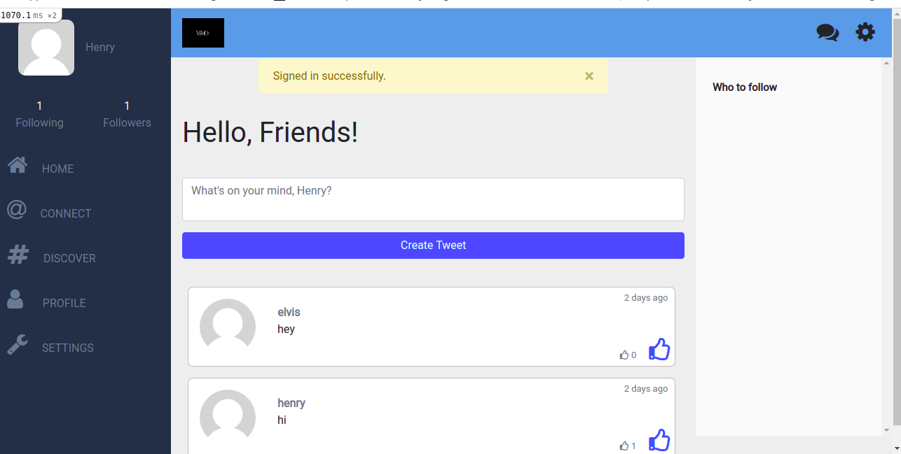

# Twitter-redesign

A social media website build with Ruby on Rails, where you can create and like tweets, follow people and see their tweets on your timeline.



## Built With

- Ruby on Rails
- Active Record
- Bootstrap 4
- Ruby
- Rspec gem

## Rspec testing

> To test of models, write the following in your terminal:

```
$ rspec
```

## live version

[Live demo](https://glacial-gorge-49167.herokuapp.com/)

## Getting Started

To get a local copy of the repository please run the following commands on your terminal:

```
$ cd <folder>
```

```
$ git clone git@github.com:verissimohenry/Twitter-redesign.git
```

```
$ cd Twitter-redesign
```

> Install webpack

```
$ rails webpacker:install
```

> Migrate the database

```
$ rails db:migrate
```

```
$ bundle install
```

> Run the rails server

```
$ rails server
```

> In order to use the website signup and login

> Post your New technology

> Visit profile of other user and follow some if you want by clicking on view profile or follow button

## AUTHOR

👤 **Verissimo Henry**

- Github: [@githubhandle](https://github.com/verissimohenry)
- Twitter: [@twitterhandle](https://twitter.com/verissimohenry)
- Linkedin: [linkedin](https://www.linkedin.com/in/henry-verissimo-618906167/)
- Email: verissimohenry04@gmail.com

## Show your support

Give a ⭐️ if you like this project!

## Acknowledgments

- Hat tip to anyone whose code was used
- Inspiration
- etc

## License

- This project is [MIT](https://opensource.org/licenses/MIT) licensed.
- This project is [creativecommons](https://creativecommons.org/licenses/by-nc/4.0/) licensed.
